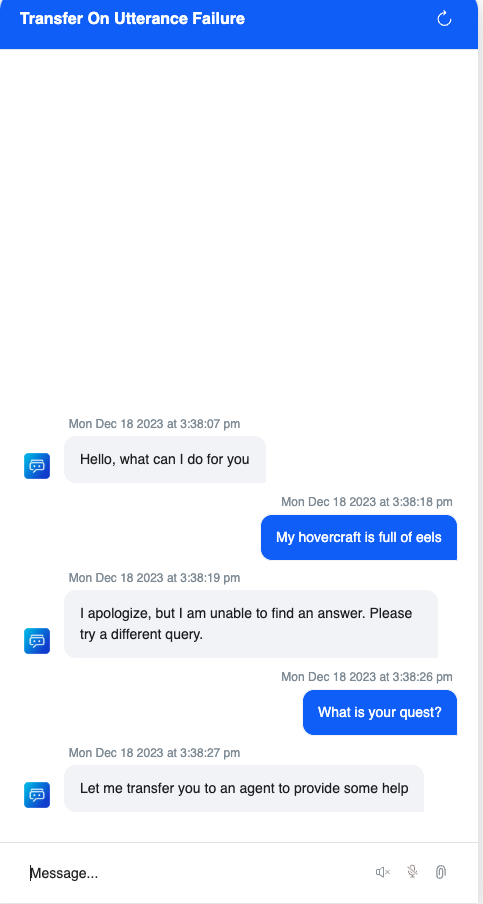
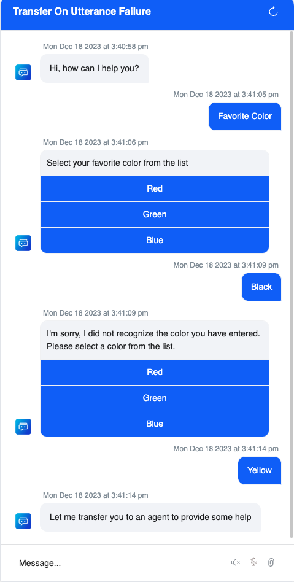

# Transfer On Utterance Failure

Shows two examples of how to respond when do you not get an expected response from a user. Attempts are made to 
repair the conversation by prompting the user but once the number of retries are exceeded the user is escalated
to an agent via _Agent Transfer_ node.

The respective examples are:

1. Exceeding retries on failure to recognize an utterance which then escalates to an agent.
2. Exceeding retries when prompting a user for a specific entity and then escalating to an agent.

## Contents

- `botDefinition.json`
- `config.json`

## Import

Use the increment import feature of XO to add Dialog Tasks and other configuration to a new or an existing bot.

See [XO VirtualAssistant Help => Import App ](https://developer.kore.ai/docs/process-apps/settings/import-export/#:~:text=your%20Process%20App.-,Import,-App)

## Content Variables

- `AGENT_TRANSFER_MESSAGE` - Response when the user has exceeded utterance failure retry count.
- `FAVORITE_COLOR_MESSAGE` - Response within the `Favorite Color` dialog task to display the user's selected color.
- `UTTERANCE_FAILURE_MESSAGE` - Response when the user utterance does not trigger a dialog task.

## Environment Variables

- `UTTERANCE_FAILURE_RETRY_COUNT` - Number of retries after a failed utterance before escalating to an agent via an _Agent Transfer_ node.

## Dialog Tasks

- Fallback Task
- Favorite Color
- Welcome Task 

## Example Dialogs

### Failed Recognition of Utterance

### Unacceptable Value for an Entity

